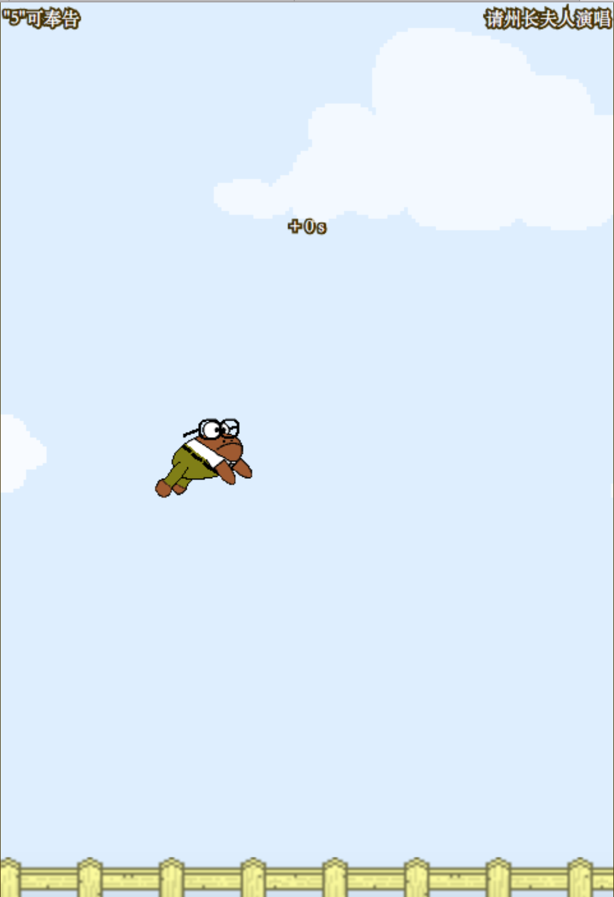
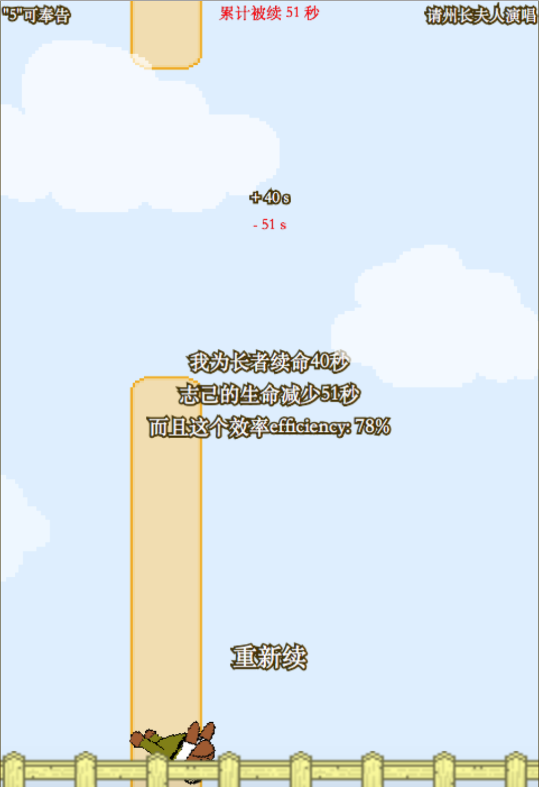

# FlappyFrog
### Introduction
This is a violent **mo**dification of [Don't Touch My Birdie](https://github.com/marksteve/dtmb) by Mark Steve Samson. Here "mo" represents a popular Chinese culture "膜".

### Link
[Click here to play](https://jerrylzy.github.io/FlappyFrog/)

### Credit
* This repo is forked from [tusenpo](https://github.com/tusenpo/FlappyFrog)'s work that memes one of the most popular network idol in China.
* The game is based on the [Parser Framework](http://phaser.io).
* The weird frog image is **mo**dified from [another frog image](https://amphibian.com/)

### Licensed
This "game" is licensed under [Creative Commons Attribution-NonCommercial 4.0 International License](https://creativecommons.org/licenses/by-nc/4.0/).

### Screenshot

